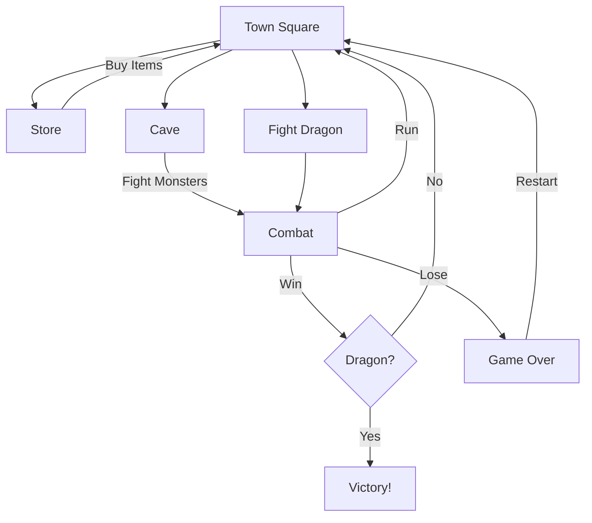

# RPG - Dragon Repeller

## Project Overview

**RPG - Dragon Repeller** is a web-based, interactive Role-Playing Game (RPG). In this game, you play as a hero whose mission is to defeat the menacing dragon preventing the townspeople from leaving. You start in the town square and must strategically manage your resources (health, gold, and experience) to upgrade your gear and battle various monsters before facing the final boss.

### Key Features

- **Interactive Gameplay:** Navigate through different locations like the Town Square, Store, and Cave.
- **Combat System:** Engage in turn-based battles with three types of monsters: Slime, Fanged Beast, and the Dragon. Options include Attack, Dodge, and Run.
- **Economy & Progression:** Earn gold and experience points (XP) by defeating monsters. Use gold to buy health potions and upgrade your weapons.
- **Inventory Management:** Upgrade your arsenal from a simple stick to powerful weapons like a dagger, claw hammer, and sword. Be careful—weapons have a chance to break!
- **Dynamic Events:** Discover a hidden Easter Egg game to gamble for extra gold or risk losing health.
- **Visual Effects:** Celebratory confetti animation upon defeating the dragon.

---

## System Design

The following state diagram illustrates the flow of the game logic and player interactions:



---

## Directory Structure

```
/
├── index.html       # Main entry point of the application
├── script.js        # Core game logic, state management, and event handling
├── style.css        # Visual styling and layout
├── LICENSE          # License information
└── README.md        # Project documentation
```

---

## Technologies Used

- **HTML5:** Provides the semantic structure of the game interface.
- **CSS3:** Handles the visual presentation, including layout (Flexbox/Grid), colors, and typography.
- **JavaScript (ES6+):** Implements the game logic, DOM manipulation, state management, and event handling.
- **External Libraries:**
  - [canvas-confetti](https://www.npmjs.com/package/canvas-confetti): Used for the visual celebration effect when the player wins.

---

## Getting Started

Follow these instructions to set up and run the project locally.

### Prerequisites

- A modern web browser (Chrome, Firefox, Safari, Edge).
- (Optional) [Git](https://git-scm.com/) for cloning the repository.

### Installation & Running

1.  **Clone the Repository** (or download the source code):
    ```bash
    git clone <repository-url>
    cd rpg-game
    ```

2.  **Open the Application:**
    - Navigate to the project folder.
    - Locate the `index.html` file.
    - Double-click `index.html` to open it in your default web browser.

    *Alternatively, you can use a live server extension (like Live Server in VS Code) for a better development experience.*

3.  **Play the Game:**
    - Use the on-screen buttons to interact with the game world.
    - Monitor your stats (XP, Health, Gold) at the top of the game container.